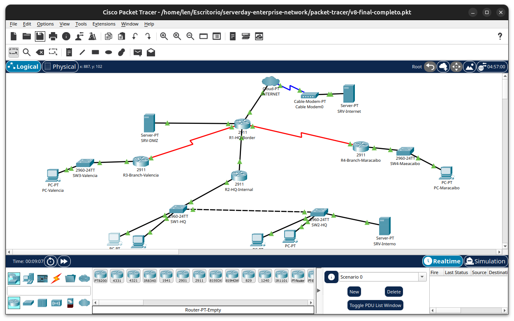
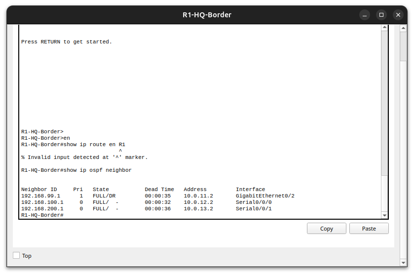
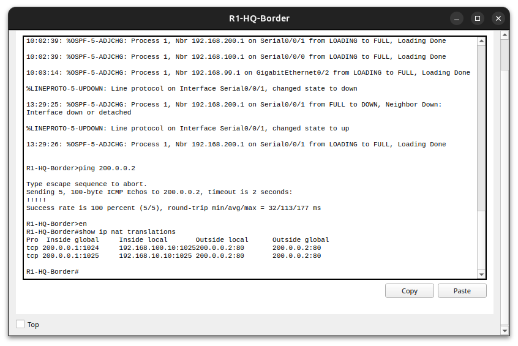
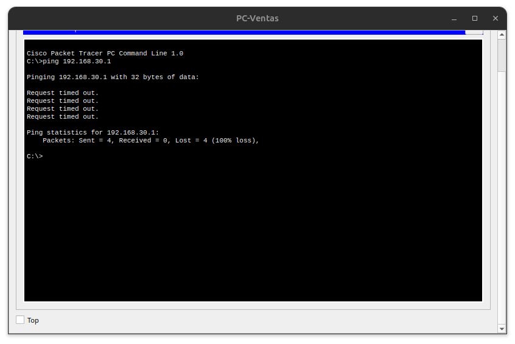

# ServerDay Enterprise Network
### Proyecto 02 — Diseño e Implementación de Red Empresarial Cisco


---

## El Escenario

**García Repuestos C.A.** es una distribuidora venezolana de repuestos 
automotrices con sede principal en Caracas y sucursales en Valencia y 
Maracaibo. Con más de 200 empleados operando en tres ciudades, la empresa 
contaba con una red plana sin segmentación, sin control de acceso y sin 
conectividad entre sedes.

**ServerDay** fue contratado para diseñar e implementar una infraestructura 
de red empresarial completa: segmentada por departamentos, con routing 
dinámico entre sedes, servicios centralizados, control de acceso y salida 
a Internet con NAT/PAT.

---

## Topología General


### Diseño inicial — V1


### Red completa operativa — V8


---

## Tecnologías Implementadas

| Tecnología | Descripción |
|---|---|
| VLANs 802.1Q | Segmentación por departamentos (Gerencia, IT, Ventas, RRHH, Servidores) |
| Router-on-a-Stick | Inter-VLAN routing en R2 con subinterfaces |
| DHCP | Asignación automática de IPs por VLAN desde SRV-Interno |
| DNS | Resolución de nombres internos (garcia.local) |
| OSPF Area 0 | Routing dinámico entre HQ y sucursales |
| NAT/PAT | Salida a Internet con traducción de direcciones |
| ACLs extendidas | Políticas de acceso por departamento |
| SSH v2 | Administración segura de todos los dispositivos |
| Port Security | Control de acceso físico en switches |
| Troubleshooting | Diagnóstico y resolución de fallos documentado |

---

## Direccionamiento IP

### Sede Principal — Caracas HQ

| VLAN | Nombre | Red | Gateway |
|---|---|---|---|
| 10 | Gerencia | 192.168.10.0/24 | 192.168.10.1 |
| 20 | IT | 192.168.20.0/24 | 192.168.20.1 |
| 30 | Ventas | 192.168.30.0/24 | 192.168.30.1 |
| 40 | RRHH | 192.168.40.0/24 | 192.168.40.1 |
| 50 | Servidores | 192.168.50.0/24 | 192.168.50.1 |
| 99 | Management | 192.168.99.0/24 | 192.168.99.1 |

### Enlaces WAN

| Enlace | Red | R1 | Router remoto |
|---|---|---|---|
| HQ ↔ R2 | 10.0.11.0/30 | 10.0.11.1 | 10.0.11.2 |
| HQ ↔ Valencia | 10.0.12.0/30 | 10.0.12.1 | 10.0.12.2 |
| HQ ↔ Maracaibo | 10.0.13.0/30 | 10.0.13.1 | 10.0.13.2 |

### Sucursales

| Sucursal | Red | Gateway |
|---|---|---|
| Valencia | 192.168.100.0/24 | 192.168.100.1 |
| Maracaibo | 192.168.200.0/24 | 192.168.200.1 |

---

## Políticas de Seguridad

| Política | Regla |
|---|---|
| POLITICA-VENTAS | Ventas no accede a VLAN Servidores |
| POLITICA-RRHH | RRHH no accede a VLAN IT |
| POLITICA-SUCURSALES | Sucursales solo acceden a Servidores |
| SSH v2 | Único método de administración remota |
| Port Security | Un dispositivo por puerto de acceso |

---

## Evolución del Proyecto

| Versión | Contenido |
|---|---|
| V1 | Topología base — dispositivos y cableado |
| V2 | VLANs + trunking + Router-on-a-Stick |
| V3 | DHCP por VLAN + DNS interno |
| V4 | OSPF Area 0 + conexión de sucursales |
| V5 | ACLs extendidas + SSH v2 + Port Security |
| V6 | NAT/PAT + salida a Internet |
| V7 | Troubleshooting documentado — 4 escenarios |
| V8 | Versión final completa |

---

## Verificaciones





---

## Estructura del Repositorio

\```
serverday-enterprise-network/
├── packet-tracer/     → Archivos .pkt por versión
├── configurations/    → Running-config de cada dispositivo
├── screenshots/       → Capturas de verificación
├── docs/             → Documentación técnica
└── README.md
\```

---

## Autor

**Nerio Delgado** — ServerDay  
*Ciberseguridad Táctica para tu Máxima Defensa*

[](https://linkedin.com/in/nerio-delgado-it)
[](https://github.com/ServerdaySupport)
